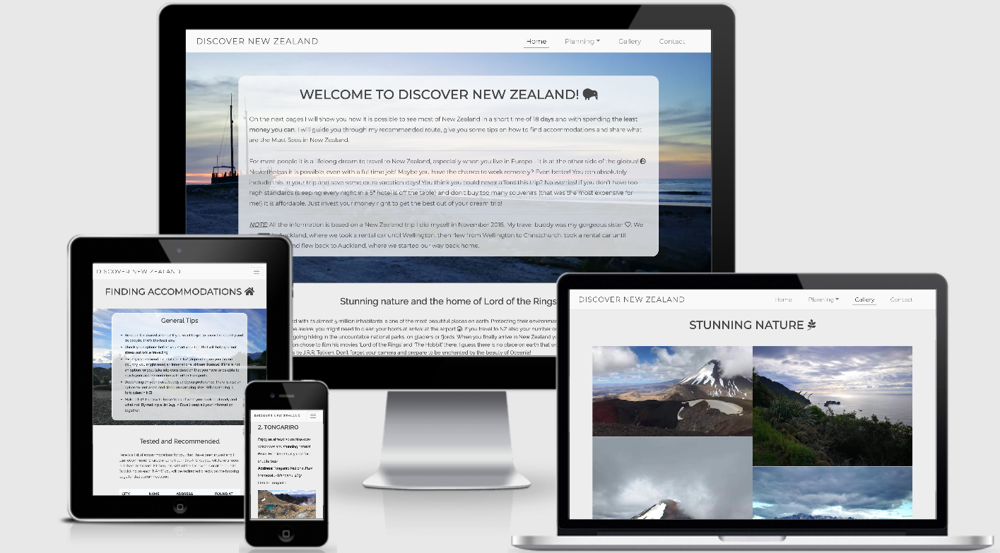

# Discover New Zealand 

Code Institute - User-Centric Frontend Development Milestone Project.

This project is a website with 7 pages about travelling to New Zealand.
The purpose of the website is to show based on experience how to travel through New Zealand in a short time (18 days) and with low budget. 

 

## [Live website in github pages](https://jacqueline-kraus.github.io/MS1-Discover-NZ/index.html)
--- 
# Table of contents
- [UX](#ux)
    - [Website owner business goals](#website-owner-business-goals)
    - [User goals](#user-goals)
    - [User stories](#user-stories)
    - [Structure of the website](#structure-of-the-website)
    - [Wireframes](#wireframes)
    - [Surface](#surface)
- [Features](#features)
    - [Existing features](#existing-features)
    - [Features left to implement](#features-left-to-implement)
- [Technologies used](#technologies-used)
- [Code Validation](#code-validation)
- [Testing](#testing)
    - [Funcionality Testing](#functionality-testing)
    - [Compatibility Testing](#compatibility-testing)
    - [User stories testing](#user-stories-testing)
    - [Bugs and problems](#bug-and-problems)
- [Deployment](#deployment)
- [Credits](#credits)

---

# UX

## Website owner business goals
- As the website owner, the goal is to provide information, inspire, and share experience for everyone interested in travelling to New Zealand. 

## User goals
- User is provided with general information about New Zealand
- User can find a possible route to take, which includes all Must Sees
- User can find tested accommodations in New Zealand with links to the booking pages
- User finds highlights and Lord of the Ring Fans tips what places to visit
- User finds inspiration through a extensive image gallery
- User can get in contact with website owner to ask questions or share experience

## User stories
### As a business owner:
- I want to give clear information and recommendation to potential New Zealand travellers
- I want to provide a clear, easy understandable website, that leads the user through

### As a user:
- I want to find information about travelling through New Zealand in a short amount of time
- I want to know which route is the best and most time saving to take
- I want to know what I have to see and what things I can leave out in my trip
- I want to know recommendations on where I can sleep
- I want to be able to ask the website owner questions about their experience

## Structure of the website

The website is optimised for all devices (desktop, mobile and tablet). It is supposed to be user friendly and easy to understand. There are small differences on some pages between mobile and desktop, to have a better visualisation of the content, based on the device. With hover effects and a lot of [links](#content) (which redirects to websites with more information) the user gets some interaction. By not only having a navigation bar on top of the page, but also having a call to action on every pages body bottom (which leads to the following page), the user has two ways to read through the website.

## Wireframes
Wireframes can be found here: [WIREFRAMES](readme-files/Wireframes-Discover-NZ.pdf)

Note: the original wireframes changed while developing the project, so some pages look very different than initially intended.

## Surface
### Fonts
The 2 fonts that were used are Montserrat and Raleway (by [Google Fonts](https://fonts.google.com/)).
Montserrat is mainly used for headlines and the Logo, Raleway is mainly used for texts that are not headlines (there may be exeptions). As a backup I used in both fonts "sans-serif"

### Colors
To have a harmonic visual impression of the website and to be aligned with the colors shown in the images, I used mainly following colors:
- Body background color: #ededed
- Text color: #464646
- Background color header and footer: #f9f9f9

### Images
- All images on the website are originally taken by me (except of 2 [screenshots](#media)). Commercial use of the images are not allowed.
- Image backup-color: black

# Features
The website consists of 7 pages. All pages are accessible by a navigation bar in the header. A different way of navigating page by page (starting with the Homepage) are the CTAs (call to action) at the bottom of the pages (except of contact page, as it is the last page you can navigate to).
## Existing Features
### Navigation Bar (in the Header):
-  Visible on all pages
- Responsive (adapts to burger menu on mobile)
- Left: Logo (linked to homepage) 
- Right 4 Links:
    - Home 
    - Planning (has a dropdown with 4 items:)
        - route
        - accommodation
	    - highlights
	    - lotr
    - Gallery
    - Contact

### CTA (call to action):
- visible on the bottom of the body in all pages, except of the contact page (last page)
- used as an option to navigate through the website (page by page)

### Footer:
- visible on all pages
- Content: social links and copyright

### Home (index.html):
- introduction text for what the website is about
- text with general information about New Zealand
- 4 images with links to different pages (in case user is interested in something in particular)

### Route (route.html):
- images of recommended route ([screenshot of Google Maps](#media))
- explanatory text for screenshot (city by city)

### Accommodation (accommodation.html):
- Text with tips for finding accommodations
- Table with recommended accommodations (includes [links to booking websites](#credits))

### Highlights (highlights.html):
- List of top 10 highlights to visit with information and links

### Lotr (lotr.html):
- 5 items for lord of the rings fans to visit in New Zealand along the trip
- includes [external links](#credits) for more information

### Gallery (gallery.html):
- image gallery to scroll through

### Contact form (contact.html):
- required form fields: Name, Emailaddress and Message
- On submit, "thank you" alert message will be shown

## Features left to implement:
- embed google maps in the route page: I used a screenshot from Google maps and linked it to a preselected route. Ideally this map would be directly embedded with Google maps. The reason I didn't do it, is that Google changed their requirements of using their [Google Maps API](https://developers.google.com/maps/documentation/javascript/overview).

# Technlogies used:
- [HTML](https://en.wikipedia.org/wiki/Hypertext_Markup_Language): for structuring the website
- [CSS](https://en.wikipedia.org/wiki/Cascading_Style_Sheets): to style the HTML code
- [Bootstrap](https://getbootstrap.com/): for responsiveness and additional style
- [Fontawesome](https://fontawesome.com/): as an icon library
- [Google Fonts](https://fonts.google.com/): as a font resource
- [hover.css](https://ianlunn.github.io/Hover/): for hover effects
- [Balsamiq](https://balsamiq.com/): for creating wireframes

- [Github](https://github.com/): for hosting the projects repository and creating a live page with [Github pages](https://pages.github.com/)
- [Gitpod](https://gitpod.io/): as a platform for developing the project
- [Git](https://en.wikipedia.org/wiki/Git): for version control

### Technology used that is required by bootstrap for some functionality to work:

- [jQuery](https://getbootstrap.com/docs/4.0/getting-started/introduction/)
- [Popper.js](https://getbootstrap.com/docs/4.0/getting-started/introduction/)
- [Javascript](https://getbootstrap.com/docs/4.0/getting-started/introduction/)

# Code Validation
- [W3 CSS Validator](https://jigsaw.w3.org/css-validator/) to validate CSS code
- [W3 HTML Validator](https://validator.w3.org/) to validate HTML code

# Testing

## Functionality testing
For testing responsiveness and styling I used for the project [Chrome Developer Tools](https://developers.google.com/web/tools/chrome-devtools).

## Compatibility testing
The website was tested through virtual devices with Chrome Developer Tools.

Browser tested: Google Chrome and Safari.

The website was tested on following hardware devices:
- Macbook Air with MacOs Catalina
- Huawei P30 Pro with Android 10
- Google Pixel 2XL with Android 11
- Microsoft Surface 7 Pro with Windows 10

## User stories testing
### As a business owner:
- I want to give clear information and recommendation to potential New Zealand travellers
    > User can find a clear roadmap of information about New Zealand. Each page has a different topic of information.

- I want to provide a clear, easy understandable website, that leads the User through
    > Through the navigation menu plus the CTAs in the bottom of each page, the user will be guided through the website. The design is rather simple with the focus on the content.

### As a user:
- I want to find information about travelling through New Zealand in a short amount of time
    > The user can find valuable information how to see most of New Zealand in a short time, through recommendations on each page.
- I want to know which route is the best and most time saving to take
    > On the page "route" the user can find the information of a detailed planned trip (with map).
- I want to know what I have to see and what things I can leave out in my trip
    > The user can find a list of highlights. Everything that is not listed there does not need to be included.
- I want to know recommendations on where I can sleep
    > User finds recommendations on the accommodation page with external links to the booking pages.
- I want to be able to ask the website owner questions about their experience
    > User can do that through the contact form.

## Bugs and problems 
- When browsing the website on desktop, there is a bug in the navigation menu. When opening the dropdown (Planning) and clicking on any item, by clicking it, the item has a blue background. This should not be the case.
- On some tablet devices the dropdown menu items are centered instead of right aligned.
- On the Lord of the rings page the text on the images was not properly readable. This was fixed by adding a text-shadow to the CSS.

# Deployment
## [Github pages](https://docs.github.com/en/github/working-with-github-pages/configuring-a-publishing-source-for-your-github-pages-site)
1. Go to repository 
2. Click on "Settings"
3. Scroll until section "GitHub Pages"
4. Select on the "source" dropdown menu the "master branch" option
5. A success message (in green) appears and it shows you the link for your live preview page in Github Pages.

## [Local deployment](https://docs.github.com/en/github/creating-cloning-and-archiving-repositories/cloning-a-repository)
1. Go to repository
2. Click on the button "code"
3. Select the "HTTPS" option.
4. Copy the URL presented
5. Open your Terminal
6. Create a directory for storing this repository
7. Type "git clone" and paste the URL in that you previously copied
8. Press enter to create local clone repository

# Credits

## Content
- All content is originally written by me.
- Information, such as prices for entry, accommodation addresses etc. are from external sources. Here is a list of all external sources used (and linked in the pages):
    - [https://www.booking.com/hotel/nz/view-on-waimapu.de.html?](https://www.booking.com/hotel/nz/view-on-waimapu.de.html?)
    - [https://www.booking.com/hotel/nz/matamata-backpackers.de.html?](https://www.booking.com/hotel/nz/matamata-backpackers.de.html?)
    - [https://www.booking.com/hotel/nz/tongariro-holiday-park.de.html?](https://www.booking.com/hotel/nz/tongariro-holiday-park.de.html?)
    - [https://www.airbnb.com/rooms/6146578](https://www.airbnb.com/rooms/6146578)
    - [https://www.airbnb.com/rooms/24024344](https://www.airbnb.com/rooms/24024344)
    - [https://www.booking.com/hotel/nz/mountain-jade-backpackers.de.html?](https://www.booking.com/hotel/nz/mountain-jade-backpackers.de.html?)
    - [https://www.booking.com/hotel/nz/haast-river-top-10-holiday-park-haast.de.html?](https://www.booking.com/hotel/nz/haast-river-top-10-holiday-park-haast.de.html?)
    - [https://www.airbnb.com/rooms/16722159](https://www.airbnb.com/rooms/16722159)
    - [https://www.booking.com/hotel/nz/fiordland-national-park-lodge.de.html?](https://www.booking.com/hotel/nz/fiordland-national-park-lodge.de.html?)
    - [https://www.booking.com/hotel/nz/nomads-queenstown.de.html?](https://www.booking.com/hotel/nz/nomads-queenstown.de.html?)
    - [https://www.booking.com/hotel/nz/haka-lodge-auckland.de.html?](https://www.booking.com/hotel/nz/haka-lodge-auckland.de.html?)
    - [https://www.hobbitontours.com/](https://www.hobbitontours.com/)
    - [https://www.tongarirocrossing.org.nz/](https://www.tongarirocrossing.org.nz/)
    - [https://www.milford-sound.co.nz/](https://www.milford-sound.co.nz/)
    - [https://www.fiordland.org.nz/visit/doubtful-sound/](https://www.fiordland.org.nz/visit/doubtful-sound/)
    - [https://www.queenstownnz.co.nz/](https://www.queenstownnz.co.nz/)
    - [https://www.franzjosefglacier.com/](https://www.franzjosefglacier.com/)
    - [https://hokitika.org/](https://hokitika.org/)
    - [https://www.wellingtonnz.com/](https://www.wellingtonnz.com/)
    - [https://www.rotoruanz.com/](https://www.rotoruanz.com/)
    - [https://www.aucklandmuseum.com/](https://www.aucklandmuseum.com/)
    - [https://nzplaces.nz/place/waiau-river-river-anduin](https://nzplaces.nz/place/waiau-river-river-anduin)
    - [https://pureglenorchy.com/](https://pureglenorchy.com/)

## Media
- On the page "Route" there are 2 screenshots taken from [Google Maps](https://www.google.de/maps).
- The icons are taken from [Fontawesome](https://fontawesome.com/)
- All other images on the website are originally taken by me. Commercial use is not allowed.

## Problem solving helpers
- [w3schools.com](https://www.w3schools.com/)
- [MDN Web Docs](https://developer.mozilla.org/en-US/docs/Learn)
- [stackoverflow](https://stackoverflow.com/)
- [Bootstrap documentation](https://getbootstrap.com/docs/4.3/getting-started/introduction/)

## Code
- [Bootstrap](https://getbootstrap.com/): for grid, form and styling of the website
- [hover.css](https://ianlunn.github.io/Hover/): for hover effects
- [Google Fonts](https://fonts.google.com/): for the fonts used
- [Fontawesome](https://fontawesome.com/): for the icons
- [Gitpod full template](https://github.com/Code-Institute-Org/gitpod-full-template) provided by Code Institute
